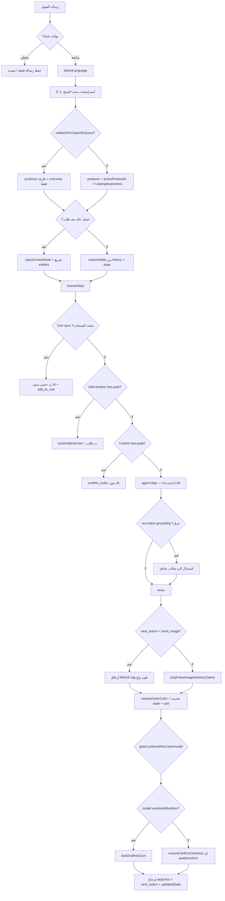

# خريطة عقل البوت (SalesGPT) — مرجع تشخيص وإصلاح

> **الغرض:** مرجع تشغيل وتشخيص دقيق. أي خلل في الرد / السلة / التأكيد / الصورة / اللون يُتتبَّع من هنا إلى الملف والشرط المحدد.  
> **الحقيقة في الكود:** هذا الملف يصف السلوك الحالي في المستودع (فرع `main` المستعاد من GitHub). عند تغيير منطق حرج: حدّث هذا الملف في نفس الـ PR.  
> **اللغة:** الشرح بالعربية؛ المعرّفات والمسارات والـ `next_action` بالإنجليزية كما في الكود.

---

## 0. مبدأ ملكية القرار (مهم جداً)

| الطبقة | ماذا تملك؟ | ماذا لا تملك؟ |
|--------|------------|----------------|
| **النموذج (LLM)** | نص الرد، اقتراح `next_action`، استخراج حقول، أعلام `customer_request` | الأسعار، المخزون، السلة، إنشاء الطلب، اللون النهائي من الكتالوج، إرفاق الصورة فعلياً |
| **الكود** | البحث في الكتالوج، السلة، اكتمال الطلب، تأكيد الطلب، الألوان، الصور، الـ grounding، التصعيد | اختراع نص مبيعات طويل (إلا رسائل القالب عند منع التسريب) |

**قاعدة ذهبية للتشخيص:** إذا المشكلة «قال شيئاً خاطئاً» → غالباً prompt / grounding. إذا المشكلة «نفّذ فعلاً خاطئاً» (طلب / سلة / صورة) → غالباً policy / pipeline، وليس الـ LLM وحده.

---

## 1. المداخل (من أين تدخل الرسالة؟)

كل القنوات الحية + تجربة البوت تصل لنفس العقل عبر مسار واحد:

```
[قناة] → (بوابات قبل الدماغ) → runSalesBotTurn / handleIncomingMessage
       → processMessage (orchestrator)
       → processWithSalesGPT (pipeline)
       → SalesGPTAgent.step (عند الحاجة)
       → [وسوم ORDER_DATA / IMAGE] → إرسال للعميل + حفظ DB
```

| المدخل | الملف / المسار | يمر عبر |
|--------|----------------|---------|
| واتساب Web | `services/whatsappWeb/inbound.ts` | `runSalesBotTurn` |
| واتساب (Baileys/قديم) | `controllers/whatsapp.controller.ts` | نفس نمط skip ثم SalesGPT |
| فيسبوك | `controllers/facebook.controller.ts` | `runSalesBotTurn` / مسار مشترك |
| إنستغرام | `controllers/instagram.controller.ts` | نفس النمط |
| تيليجرام | (controllers/telegram*) | نفس الدماغ |
| تجربة البوت (لوحة التاجر) | `controllers/ai.controller.ts` | `handleIncomingMessage` مباشرة ثم `appendOrderDataIfConfirmed` |

**نقطة الدخول الموحدة للعقل:**

1. `bot/index.ts` → `handleIncomingMessage`
2. `core/orchestrator.ts` → `processMessage` → **دائماً** `processWithSalesGPT`
3. `services/salesgpt/index.ts` → الدماغ الكامل
4. `services/channels/botTurn.ts` → `runSalesBotTurn` (قنوات حية: دماغ + ORDER_DATA + تصعيد + حفظ رسائل)

**إعداد التاجر الموحّد:** `services/buildMerchantBotConfig.ts`  
يفرض `use_full_ai_mode: true` لكل القنوات وتجربة البوت.

---

## 2. بوابات ما قبل الدماغ (قد لا يصل الطلب لـ SalesGPT أصلاً)

افحص هذه أولاً إذا «البوت ما ردّ»:

| الشرط | السلوك | أين |
|-------|--------|-----|
| `bot_disabled` أو `status === 'human'` | تخطّي الرد | inbound / controllers |
| آخر رسالة من موظف بشري خلال **5 دقائق** | تخطّي الرد | نفس المواضع |
| الخطة لا تشمل Sales Bot (`hasSalesBot`) | تخطّي | plan limits |
| حد استهلاك الردود الشهرية | تخطّي / رفض | plan limits |
| فشل تقني في الـ orchestrator | رد خطأ عام + `failed: true` | `botTurn.ts` |

بعد نجاح الدماغ:

| الحدث | السلوك |
|-------|--------|
| `<ESCALATE>` في النص أو `shouldEscalate` | `escalateConversationToHuman` + مرحلة `handoff` |
| `next_action === confirm_order` + بيانات كاملة | إلحاق `[ORDER_DATA]...[/ORDER_DATA]` ثم القناة تفسّره وتحفظ الطلب |

---

## 3. مخطط التدفق الشامل (Pipeline)



---

## 4. مراحل المحادثة (Stages 1–9)

المصدر: `services/salesgpt/stages.ts` + اشتقاق من `next_action` في `agent.ts`.

| stage_id | الاسم | هدف المرحلة | `current_stage` (قديم) |
|----------|-------|-------------|-------------------------|
| 1 | مقدمة / ترحيب | استقبال، تعريف مرة واحدة | `discover` |
| 2 | اكتشاف الاحتياجات | سؤال مفتوح | `discover` |
| 3 | عرض القيمة | ربط الوصف بحاجة العميل | `offer` |
| 4 | عرض الحلول / المنتج | سعر + 2–3 فوائد + سؤال قرار | `offer` |
| 5 | اعتراضات | رد من الوصف/السياسات فقط | `objection` |
| 6 | إغلاق البيع | دفع نحو الشراء | `close` |
| 7 | جمع معلومات الطلب | حقل واحد لكل رد | `close` |
| 8 | تأكيد الطلب | ملخص + طلب موافقة صريحة | `close` |
| 9 | إنهاء / تصعيد | شكر أو handoff بشري | `close` أو `handoff` |

**مصدر الحقيقة للمرحلة:** `conversation_state.salesgpt_stage_id`  
يُكتب فقط عبر `applySalesGPTStage` / `applyFreshConversationStage` / `applyHandoffStage`  
(`conversationStateSync.ts`).

**اشتقاق المرحلة من `next_action`:**

| next_action | stage_id |
|-------------|----------|
| `greet` | 1 |
| `discover_needs` | 2 |
| `present_product` / `send_image` / `add_to_cart` | 4 |
| `handle_objection` | 5 |
| `close_sale` | 6 |
| `collect_info` | 7 |
| `await_confirmation` / `confirm_order` | 8 |
| `end_conversation` | 9 |

لا يوجد استدعاء AI منفصل لتحديد المرحلة. المرحلة مشتقة دائماً.

---

## 5. قيم `next_action` (عقد القرار)

ما يسمح به النموذج في JSON (`SALESGPT_MODEL_NEXT_ACTIONS`):

`greet` · `discover_needs` · `present_product` · `handle_objection` · `close_sale` · `collect_info` · `await_confirmation` · `confirm_order` · `send_image` · `end_conversation`

قيم يضيفها **الكود فقط** (ليست من مخرجات النموذج الخام عادةً):

| action | المعنى |
|--------|--------|
| `add_to_cart` | قفل مسودة في السلة / مزامنة سلة متعددة (`conversationCart.ts`) |
| `handoff` | تصعيد بشري (عبر sanitize / escalate) |

### متى يُسمح بـ `confirm_order`؟

فقط إذا تحققت معاً (في `resolveOrderNextAction` و/أو fast-path):

1. اكتمال الهوية: اسم + هاتف + عنوان (قيم حقيقية، ليست placeholders).
2. اكتمال السلة أو مسودة قابلة للقفل (منتج + لون/مقاس إن وُجدا في الكتالوج).
3. نية إنهاء صريحة من العميل: موافقة (`customerAffirmsOrder`) **أو** رفض إضافة المزيد بينما البوت سأل «هل تريد شيئاً آخر؟».
4. السياق يسمح: البوت كان يطلب تأكيداً **أو** الحقول كانت مكتملة قبل هذه الرسالة **أو** رفض الإضافة بعد سؤال upsell.
5. اللون (إن وُجد في المنتج) صالح في الكتالوج (`gateConfirmWhenColorInvalid`).

غير ذلك → أقصى ما يصل إليه الكود عادةً `await_confirmation` أو `collect_info`.

**إنشاء الطلب في القناة:** فقط عندما `next_action === confirm_order` **و** النص الظاهر للعميل غير فارغ (`shouldAppendOrderData`) ثم `appendOrderDataIfConfirmed`.

---

## 6. `TurnIntent` — تصنيف الدور قبل سكك الطلب

الملف: `services/salesgpt/turnIntent.ts`

**الأولوية (من الأعلى):**

1. `finalize` — تأكيد/إنهاء طلب (ما لم تكن صورة في نفس النفس)
2. `browse_media` — طلب صورة صريح أو لون بعد عرض صورة
3. `product_qa` — تفاصيل منتج / بدائل
4. `cart_edit` — إضافة منتج آخر
5. `other`

| Intent | يفرض `next_action` | يمنع |
|--------|-------------------|------|
| `browse_media` | `send_image` | `collect_info` / `await_confirmation` / `confirm_order` |
| `product_qa` | `present_product` (إلا send_image أو end_conversation) | اختطاف checkout |
| `cart_edit` | يميل لـ `present_product` | تأكيد مبكر |
| `finalize` | يمر لسكك الطلب | — |

`isExplicitPhotoRequest`: يجب وجود مفردات صورة + نية إرسال/عرض (عربي/إنجليزي). ليس كل «ابعث» صورة.

---

## 7. أعلام `customer_request` (من النموذج)

الملف: `services/salesgpt/customerRequest.ts`

```ts
{
  wants_alternatives: boolean,
  asks_product_info: boolean,
  wants_photo: boolean,
  ready_to_confirm: boolean,
  wants_add_another: boolean
}
```

- الفهم للنية ينتمي للنموذج؛ الكود يطبّع ويعزّز بـ heuristics.
- `ready_to_confirm` **وحده لا يكفي** لإنشاء طلب — `orderConfirmationPolicy` يفرض البوابة.
- غياب الكتلة → كل الأعلام `false` (محافظ).

---

## 8. بحث المنتج وتركيز الكتالوج (قبل الـ Agent)

الملف: `services/salesgpt/index.ts` — STEP 1

| الترتيب | الاستراتيجية | متى |
|---------|--------------|-----|
| −1 | منتج مُزرع من إعلان/تعليق (`extracted_entities.product_id`) | acquisition |
| 0a | أسماء منتجات مذكورة في **الرسالة الحالية** | الأعلى لأولوية التركيز/الصورة |
| 0 | `product_query` من الـ state | تبديل التركيز |
| 1 | كلمات مفتاحية من الرسالة (`productKeywords`) | بحث |
| 1b | طلب صورة بلا اسم → آخر ذكر منتج في رسائل المستخدم الحديثة | تركيز صورة |
| 2 | `last_recommended_products[0]` | استمرار السياق |
| 3 | Top products (تصفح / بداية باردة) | فقط إن لم يكن «عدم تطابق حقيقي» |

**عدم تطابق حقيقي (`noMatchForSpecificQuery`):**

`hadSpecificSearchIntent && !searchMatchedQuery`

عندها: لا يُعتبر صف عشوائي من التوب «المنتج النشط»، ولا تُرفق صورة عشوائية، ويُفعَّل فحص `catalogGrounding`.

دائماً يُرفق: `getProductsOverview` + `getCatalogMeta` كـ `CatalogAwareness` حتى يجيب النموذج بصدق عن البدائل.

---

## 9. مسارات حتمية بدون LLM (Fast-paths)

تحدث **قبل** `agent.step` داخل `processWithSalesGPT`:

### 9.1 مزامنة سلة متعددة المنتجات

- الشرط: `shouldSyncMultiProductCart(message, mentionedProducts)` وليس سؤال معلومات/صورة.
- السلوك: بناء سطور من المنتجات المذكورة + كميات آمنة → رسالة قالب → `next_action: add_to_cart`، `aiCallsCount: 0`.

### 9.2 إضافة منتج آخر (`add_to_cart`)

- الشرط: نية إضافة أخرى + مسودة مكتملة أو سلة غير فارغة.
- السلوك: `lockDraftIntoCart` → رسالة شكر/ملخص سلة → stage 4.

### 9.3 تأكيد طلب حتمي (`confirm_order`)

- الشرط: كنا في مسار إغلاق (`awaiting_order_confirmation` أو stage 6/7/8 أو آخر رد طلب تأكيداً) **و** الاكتمال **و** اللون صالح **و** موافقة أو رفض إضافة بعد سؤال upsell **و** ليس سؤال معلومات منتج.
- السلوك: رسالة تأكيد قالب + `ensureCartForCheckout` بدون استدعاء AI.

### 9.4 عميل عائد بعد طلب

- `last_order` موجود + `message_count === 0` + stage طازج (1).
- يحقن ملاحظة سياق للنموذج ويفرغ entities؛ يمنع التأكيد التلقائي لطلب جديد.

---

## 10. داخل `SalesGPTAgent.step` (قلب الرد)

الملف: `services/salesgpt/agent.ts`

```
1. أدوات (إن products فارغة وليس no-match) → ProductSearch فقط حالياً في المسار الحي
2. بناء سياق المنتج + الكتالوج في الـ prompt
3. استدعاء AI واحد: نص + next_action + extracted_info + customer_request
4. تطبيع next_action أو fallback من المرحلة
4.1 TurnIntent → فرض browse actions
4.1b/c بدائل / إضافة أخرى → إبعاد عن checkout
4.2 resolveOrderNextAction (سكك الطلب)
4.3 كشف <ESCALATE> → end_conversation + نية complaint
5. اشتقاق stage من next_action
6. إضافة الرد للتاريخ (بدون markers)
```

**الأدوات المعرفة** (`tools.ts`) — متاحة للتعريف؛ التنفيذ الحي في `step` يستدعي أساساً `ProductSearch` عند فراغ المنتجات:

- `ProductSearch`
- `ProductDetails`
- `ShowCatalog`
- `CatalogOverview`
- `CheckAvailability`

---

## 11. سكك تأكيد الطلب (`orderConfirmationPolicy`)

الملف: `services/salesgpt/orderConfirmationPolicy.ts` — الدالة المركزية: `resolveOrderNextAction`

ترتيب القرارات داخل الدالة:

1. إن `browse_media` / `product_qa` → إخراج فوري آمن (لا ملخص طلب).
2. إن طلب معلومات منتج → `present_product` (أو send_image / end).
3. إلغاء صريح والطلب مكتمل → `end_conversation` + رسالة إلغاء.
4. «لا» عند سؤال التأكيد (وليس سؤال إضافة) → توضيح غموض، يبقى `await_confirmation` (لا تأكيد).
5. لون بعد عرض صورة وغير مسموح بالإنهاء → `send_image`.
6. `allowedToFinalize` → `confirm_order` + رسالة شكر آمنة.
7. غير مكتمل وحاول النموذج التأكيد/الملخص → `collect_info` + سؤال الحقل الناقص.
8. مكتمل بلا إنهاء صريح → `await_confirmation` + ملخص إن لزم.
9. وإلا تمرير `aiNextAction`.

**Heuristics مساعدة:**

| دالة | دور |
|------|-----|
| `customerAffirmsOrder` | نعم / أكد / تم… (مع استثناء إلغاء ومعلومات منتج) |
| `customerDeclinesMoreItems` | لا قصيرة بعد سؤال «شيء آخر؟» |
| `customerCancelsOrder` | إلغاء الطلب |
| `botReplyAsksForConfirmation` | هل آخر رد بوت يطلب تأكيداً؟ |
| `botReplyAsksToAddMore` | هل سأل إضافة منتج؟ |
| `isProductInfoRequest` | يمنع التأكيد والـ fast-path |
| `isPrematureCheckoutCopy` | يكشف تسريب ملخص طلب مبكر |
| `shouldAppendOrderData` | يمنع ORDER_DATA صامت بدون نص للعميل |

---

## 12. السلة (`conversationCart`)

الملف: `services/salesgpt/conversationCart.ts`

**الملكية:** الكود يكتب السلة؛ النموذج لا يخترع JSON سلة.

| مفهوم | المعنى |
|-------|--------|
| Draft line | المنتج قيد النقاش في `extracted_entities` (لون/مقاس/كمية) قبل القفل |
| `cart.items[]` | سطور مؤكدة داخل المحادثة |
| `lockDraftIntoCart` | نقل المسودة إلى سطر سلة ومسح حقول المنتج من المسودة |
| `ensureCartForCheckout` | قبل await/confirm: ضمان وجود سطر سلة من المسودة |
| `fillCartVariantsFromDraft` | كتابة اللون/المقاس على السطر المطابق فوراً؛ إن السلة فارغة والمسودة مكتملة تُرقّى لسطر |
| `replaceCartItems` | **دمج** المنتجات المذكورة في السلة (لا حذف السطور القائمة؛ الكميات لا تُصفَّر) عبر `cartLineOps.mergeCartLines` |
| `cartLineOps.ts` | واجهة ضيقة: `addCartLine` / `mergeCartLines` / `updateCartLineById` / `removeCartLineById` |
| `clearDraftOnFocusChange` | عند تغيّر المنتج المركّز: مسح product/color/size من المسودة (لا توريث بين SKUs) |
| `canonicalizeLineColor` | لون السطر من كتالوج **نفس** المنتج فقط؛ إن لا ألوان → `null` |
| `resolveLineCurrency` | عملة السطر من المنتج ثم عملة المتجر — بلا افتراض `USD` ثابت في `normalizeCart` |
| `formatCartSummary` / `cartSummary.ts` | ملخص مسعّر: سطر (اسم+متغير+كمية+سعر) + مجموع **لكل عملة**؛ سعر ناقص → «غير مكتمل» |
| `buildAddedToCartMessage` | «تمام، أضفت {اسم} لطلبك.» + ملخص مسعّر (بلا ✅ / بلا تبي·تحب) |

**عقد اللون (PHASE 2A FIX 1):** اللون ملك السطر، لا المسودة العامة. منتج بلا `colors` لا يرث لوناً من مسودة/سلة منتج آخر.

**اكتمال الدفع (`isCheckoutReady`):**

- دائماً: `name` + `phone` + `address`
- إن السلة فارغة: مسودة مكتملة (`product` + لون/مقاس إن لزم)
- إن السلة فيها عناصر + منتج مركّز: تحقق لون/مقاس لذلك SKU

`ADD_TO_CART_ACTION = 'add_to_cart'`

---

## 13. سياسة اللون (`orderColorPolicy`)

الملف: `services/salesgpt/orderColorPolicy.ts` + استخدام في `index.ts`

**مصدر الحقيقة:** رسالة العميل + تاريخ رسائله + `product.colors`.  
استخراج النموذج استشاري ولا يطغى على اختيار العميل المثبت.

| الحالة | السلوك |
|--------|--------|
| رقم خيار («2»، «رقم 2») | يُترجم لخيار الكتالوج |
| لون نصي يطابق الكتالوج | يُعتمد |
| غموض بين خيارين | سؤال توضيح؛ `color = null` |
| لون AI مرفوض | رسالة «غير متوفر» + قائمة الخيارات |
| محاولة `confirm_order` بلون باطل | `gateConfirmWhenColorInvalid` يُرجع لـ await + طلب لون |

---

## 14. الصور

| الشرط | النتيجة |
|-------|---------|
| `next_action === send_image` و ليس no-match | إلحاق `[IMAGE: url]` بعد تنظيف التعليق |
| اختيار المنتج للصورة | ذكر حالي → اسم في collectedInfo → activeProductId → products[0] |
| لون مطلوب | `resolveProductImageForBot` (صورة بلون إن وُجدت) |
| نموذج ادّعى إرسال صورة دون `send_image` | `stripFalseImageDeliveryClaims` |
| no-match + send_image | لا صورة عشوائية |

الكلمات المفتاحية لطلب الصورة: انظر `isExplicitPhotoRequest`.

---

## 15. Grounding عند عدم وجود المنتج

الملف: `services/salesgpt/catalogGrounding.ts`

يُفعَّل فقط عند `noMatchForSpecificQuery`.

`violatesNoMatchGrounding`: الرد يذكر سعراً **ليس** في نظرة الكتالوج **ولا** يعترف بعدم التوفر → يُستبدل بقالب صادق (`buildNoMatchFallbackMessage`).

هذا **ليس** كاشف هلوسة عاماً لكل الردود.

---

## 16. الـ Prompt والشخصية

الملف: `services/salesgpt/prompts.ts`

- مراحل 1–9 + قواعد: رد قصير، سؤال واحد، لا اختلاق أسعار، إقناع من الوصف فقط.
- جمع الحقول: **حقل واحد لكل رسالة** بالترتيب: اسم → هاتف → عنوان → لون → مقاس → كمية.
- مسار `<ESCALATE>` عند طلب إنسان / إحباط شديد.
- سياسات المتجر (شحن، دفع، إرجاع) من `MerchantConfig` تُحقن في الـ system prompt.

---

## 17. حالة المحادثة `ConversationState` (ما يُحفَظ)

أهم الحقول التي يعتمد عليها الدماغ:

| حقل | دور |
|-----|-----|
| `salesgpt_stage_id` | المرحلة 1–9 |
| `current_stage` | مشتق (أو `handoff`) |
| `extracted_entities` | name, phone, address, product_*, color, size, quantity |
| `cart` | `{ items, status, updatedAt }` |
| `awaiting_order_confirmation` | true بعد `await_confirmation` |
| `last_recommended_products` | تركيز المنتج / مصادر ORDER_DATA |
| `last_order` | سياق عميل عائد |
| `message_count` | تمييز أول دور بعد إعادة التعيين |
| `language` | arabic / english |
| `last_intent` | نية آخر دور |

بعد `confirm_order` الناجح في القناة: `resetConversationAfterOrder` → stage 1 + الاحتفاظ بـ `last_order` المختصر.

---

## 18. ما بعد الدماغ (القناة)

```
replyText
  → appendOrderDataIfConfirmed (إن confirm_order)
  → escalate إن لزم
  → stripInternalControlMarkers
  → parseBotReplyTags → IMAGE + ORDER_DATA
  → إرسال نص/صورة عبر القناة
  → persistOrderIfPresent إن ORDER_DATA كامل
  → تحديث conversations.conversation_state
```

ملفات: `botTurn.ts`, `buildMerchantBotConfig.ts`, `channelBotOrder.ts`, `response/sanitize-reply.ts`

---

## 19. خريطة الملفات (مرجع سريع)

```
backend/src/
├── bot/index.ts                    # handleIncomingMessage
├── core/orchestrator.ts            # processMessage → SalesGPT فقط
├── core/types.ts                   # Intent, Stage, ConversationState, Product…
├── pipelines/smart-pipeline/       # غلاف يعيد تصدير processWithSalesGPT
├── services/
│   ├── buildMerchantBotConfig.ts   # إعداد تاجر موحّد + ORDER_DATA
│   ├── channels/botTurn.ts         # دورة قناة كاملة
│   ├── escalation.ts               # تحويل لموظف
│   └── salesgpt/
│       ├── index.ts                # PIPELINE الرئيسي (بحث + fast-paths + صور + state)
│       ├── agent.ts                # step + LLM + TurnIntent + order rails
│       ├── stages.ts               # أوصاف 1–9
│       ├── prompts.ts              # system prompts
│       ├── tools.ts                # أدوات الكتالوج
│       ├── turnIntent.ts           # تصنيف الدور
│       ├── customerRequest.ts      # أعلام JSON
│       ├── orderConfirmationPolicy.ts  # بوابات التأكيد
│       ├── conversationCart.ts     # السلة
│       ├── orderColorPolicy.ts     # الألوان
│       ├── catalogGrounding.ts     # no-match
│       ├── conversationStateSync.ts# كتابة المرحلة
│       └── productKeywords.ts      # كلمات البحث
├── catalog/                        # search / overview / image resolve
└── response/                       # sanitize, image caption, escalate markers
```

اختبارات ذهبية مهمة عند أي إصلاح منطق:

- `test_turn_intent_golden.ts`
- `test_customer_request_golden.ts`
- `test_conversation_cart.ts`
- `test_verification_matrix.ts`

---

## 20. دليل تشخيص المشاكل (من العرض إلى السبب)

| العرض | ابدأ من | تحقق من |
|-------|---------|---------|
| البوت لا يرد أبداً | §2 بوابات القناة | human mode، 5 دقائق، الخطة، الحدود |
| يرد منتجاً خاطئاً | §8 بحث | 0a ذكر حالي vs seed إعلان vs history |
| يقول سعر/منتج غير موجود | §15 grounding + §8 no-match | هل `hadSpecificSearchIntent`؟ |
| يطلب اسم/عنوان أثناء طلب صورة | §6 TurnIntent + §11 | هل `browse_media` فُرض؟ |
| يرسل صورة بلا طلب | §14 + agent 4.1 | `allowSendImage` / demote |
| لا يرسل صورة رغم الطلب | §14 + تركيز منتج | `send_image`؟ منتج بلا `imageUrl`؟ |
| لون خاطئ على الطلب | §13 | تاريخ المستخدم vs AI |
| أكّد طلباً بدون «نعم» | §5 + §11 + §9.3 | `allowedToFinalize` / fast-path |
| «نعم» ولم يُنشأ طلب | §5 اكتمال + لون + ORDER_DATA | `isCheckoutReady`، `shouldAppendOrderData` |
| سلة بمنتجين صارت كمية 2 لواحد | §12 `coerceSafeQuantity` / sync | `messageSignalsBothProducts` |
| أراد منتجاً إضافياً فتم التأكيد | §9.2 + `wants_add_another` | هل `lockDraft` أم confirm؟ |
| تصعيد لا يحدث | `<ESCALATE>` + sanitize | `shouldEscalate` في botTurn |
| تجربة البوت تختلف عن واتساب | §1 | نفس `handleIncomingMessage`؛ فرق فقط في الإرسال والحفظ |

**ترتيب تتبع لوج دور واحد:**

1. هل دخل `processWithSalesGPT`؟
2. أي استراتيجية منتج اختيرت؟ (`searchMatchedQuery` / `noMatch`)
3. هل خرج من fast-path قبل LLM؟
4. إن LLM: ما `customer_request` و `aiNextAction`؟
5. ما `TurnIntent` النهائي؟
6. ما `reason` من `resolveOrderNextAction`؟
7. ما `effectiveNextAction` بعد بوابات اللون/السلة؟
8. هل أُلحق `ORDER_DATA` أو `IMAGE`؟

---

## 21. الخطوط الحمراء (عقود لا تُكسر)

1. لا اختلاق سعر/منتج/مخزون/لون/مقاس/سياسة خارج البيانات المحقونة.
2. لا `confirm_order` → لا `ORDER_DATA` → لا طلب في DB.
3. لا خلط عملات ولا اختراع سعر صرف.
4. لا إعلان «أضفت/أرسلت صورة/ثبّت الطلب» إلا إذا نفّذ الكود ذلك.
5. لا بيع منتج نافد أو لون خارج الكتالوج.
6. طلب صورة أو سؤال تفاصيل المنتج لا يُخطَف إلى checkout.
7. المرحلة تُشتق من `next_action`؛ لا AI منفصل للمرحلة.
8. السلة ملك الكود.

---

## 22. ملخص مسار الحياة لطلب ناجح

```
تصفح/ترحيب (1–2)
  → تركيز منتج (بحث 0a/1/2)
  → عرض (4) ± صورة عند طلب صريح (send_image)
  → اعتراضات إن وجدت (5)
  → جمع حقول واحداً واحداً (7) + لون/مقاس من الكتالوج
  → ملخص + await_confirmation (8)
  → موافقة صريحة من العميل
  → confirm_order (كود) + ORDER_DATA
  → حفظ الطلب في القناة + reset المحادثة (stage 1 + last_order)
```

أي انحراف عن هذا المسار يجب أن يطابق قسماً صريحاً أعلاه (fast-path، browse، إلغاء، تصعيد، no-match). وإلا فهو خلل يُصلَح في الملف المشار إليه.

---

*آخر مزامنة مع الكود: بعد استعادة `SOFEANMOHAMED/xo-bot` @ `2ddd948` (SalesGPT الحي). لا يوجد Brain v2 في هذا المستودع حالياً.*
