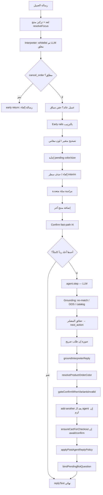

# خريطة عقل البوت (SalesGPT) — من استقبال الرسالة حتى إرسال الرد

> **الغرض:** مرجع تشغيل وتشخيص دقيق بعد توحيد ملكية الرد (`ReplyPolicy` + سياسة الهوية المجمّعة).  
> **الحقيقة في الكود:** يصف السلوك الحي في المستودع. عند تغيير منطق حرج: حدّث هذا الملف في نفس الـ PR.  
> **اللغة:** الشرح بالعربية؛ المعرّفات والمسارات و`next_action` بالإنجليزية كما في الكود.

---

## 0. مبدأ ملكية القرار

| الطبقة | تملك | لا تملك |
|--------|------|---------|
| **LLM** | مسودة `response_text` + اقتراح `next_action` + `customer_request` + `extracted_info` استشاري | السلة، إنشاء الطلب، اللون/المقاس النهائي، قوالب الهوية/اللون/await/confirm، إرفاق الصورة |
| **المفسّر (Interpreter)** | نية مغلقة (whitelist/LLM مغلق)، كتابة سلة/هوية/متغير على الحالة، إسهام في `next_action` | نص مبيعات طويل حر |
| **ReplyPolicy / القوالب** | النص الصادر النهائي للقرارات المملوكة (جمع هوية، لون/مقاس، await، confirm، cancel، سلة) | فهم نية حرّة |
| **الكود الحتمي** | تركيز المنتج، اكتمال الطلب، I4 تأكيد، صور، grounding | — |

**قاعدة تشخيص:** «قال خطأ» → غالباً prompt/grounding. «نفّذ فعل خطأ» (طلب/سلة/صورة) → غالباً policy/pipeline.

**مصادر حقيقة واحدة (SSOT):**

| القرار | المالك |
|--------|--------|
| نص الرد الصادر للقرارات القالبية | `replyPolicy.ts` (`composeOutboundReply` / `applyPostAgentReplyPolicy`) |
| سؤال الهوية | `collectInfoOrder.ts` |
| سؤال لون/مقاس | `variantEngine/ask.ts` (+ غلاف `orderColorPolicy`) |
| تأكيد الطلب النهائي | `resolveConfirmFinalize` (I4) داخل `orderConfirmationPolicy.ts` |
| بوابة استبدال القالب | `deterministicReplyGate.ts` (`mayReplaceWithOrderTemplate`) |
| CTA السلة | `cartActionCta.ts` |
| تتبع من كتب الرد | `replyOwnership.ts` (ظل — لا يغيّر النص) |

---

## 1. المداخل — من أين تدخل الرسالة؟

```
[قناة] → بوابات ما قبل الدماغ
       → runSalesBotTurn  (قنوات حية)
       → handleIncomingMessage  (bot/index.ts)
       → processMessage  (core/orchestrator.ts)
       → processWithSalesGPT  (services/salesgpt/index.ts)
       → [وسوم ORDER_DATA / IMAGE] → إرسال + حفظ DB
```

| المدخل | الملف | يمر عبر |
|--------|-------|---------|
| واتساب Web | `services/whatsappWeb/inbound.ts` | `runSalesBotTurn` |
| واتساب | `controllers/whatsapp.controller.ts` | نفس النمط |
| فيسبوك | `controllers/facebook.controller.ts` | `runSalesBotTurn` |
| إنستغرام | `controllers/instagram.controller.ts` | نفس النمط |
| تيليجرام | controllers تيليجرام | نفس الدماغ |
| تجربة البوت (لوحة) | `controllers/ai.controller.ts` | `handleIncomingMessage` مباشرة |

**نقاط الدخول:**

1. `bot/index.ts` → `handleIncomingMessage` (إعداد `MerchantConfig` ثم `processMessage`)
2. `core/orchestrator.ts` → `processMessage` → **دائماً** `processWithSalesGPT`
3. `services/salesgpt/index.ts` → الدماغ الكامل
4. `services/channels/botTurn.ts` → `runSalesBotTurn` (دماغ + ORDER_DATA + تصعيد + حفظ)

إعداد التاجر: `services/buildMerchantBotConfig.ts` (`use_full_ai_mode: true`).

---

## 2. بوابات ما قبل الدماغ

افحص أولاً إن «البوت ما ردّ»:

| الشرط | السلوك |
|-------|--------|
| `bot_disabled` أو `status === 'human'` | تخطّي الرد |
| آخر رسالة موظف خلال 5 دقائق | تخطّي |
| الخطة بلا Sales Bot | تخطّي |
| حد استهلاك شهري | تخطّي/رفض |
| فشل orchestrator | رد خطأ + `failed: true` |

بعد نجاح الدماغ:

| الحدث | السلوك |
|-------|--------|
| `<ESCALATE>` أو `shouldEscalate` | تصعيد بشري + مرحلة `handoff` |
| `next_action === confirm_order` + اكتمال | إلحاق `[ORDER_DATA]...[/ORDER_DATA]` ثم حفظ الطلب |

---

## 3. مخطط التدفق الحي داخل `processWithSalesGPT`



**قاعدة الفوز:**

- **Early rail** يعيد رداً كاملاً → الـ LLM لا يعمل.
- بعد الـ agent: `applyPostAgentReplyPolicy` هو **آخر مالك للنص** للقرارات القالبية (ليس «آخر كاتب عشوائي»).

---

## 4. ترتيب Early Rails (قبل الـ LLM)

كلها داخل `services/salesgpt/index.ts`؛ أي مسار ناجح يُرجع `replyText` فوراً (`aiCallsCount: 0`):

| # | الحدث | الملفات / البناء |
|---|--------|------------------|
| 0 | Interpreter `cancel_order` | `buildOrderCancelledMessage` |
| 1 | تصحيح متغير (لون/مقاس) | `resolveVariantChange` + رسائل updated/unchanged/unavailable/ask_which |
| 2 | إجابة `pending_bot_question` | `pendingBotQuestion` + `buildPendingSelectMessage` / unavailable |
| 3 | إلغاء كلي / حذف سطر | `interimCancelMatchers` + `cartLineRemoval` + قوالب `replyPolicy` |
| 4 | سلة متعددة منتجات | `buildCartSyncedMessage` |
| 5 | إضافة منتج آخر | `lockDraftIntoCart` + `buildAddedToCartMessage` |
| 6 | Confirm fast-path | `resolveConfirmFinalize` + `buildOrderConfirmedMessage` |

نصوص الـ early rails تمر عبر `ownReply` → `logReplyOwnership` (ظل).

---

## 5. المفسّر (Interpreter)

المجلد: `services/salesgpt/interpreter/`

| ملف | دور |
|-----|-----|
| `index.ts` | واجهة: whitelist أولاً؛ ثم LLM إن `INTERPRETER_MODE=flip` للأنواع المقلوبة |
| `whitelist.ts` | هوية بعد سؤال بوت، pending لون/مقاس، إلغاء/حذف، handoff، نعم/لا عند await |
| `apply.ts` | كتابة الحالة فقط (سلة، entities، أعلام) — **بدون نص رد** |
| `nextAction.ts` / `turnFacts.ts` | تقليل `next_action` من الحقائق؛ لا يصدر `confirm_order` (I4 فقط) |
| `ground.ts` | صدق الرد بعد الـ agent |
| `flip.ts` | أنواع مسموح للـ LLM بتطبيقها حياً |

بعد تطبيق هوية (`provide_identity_field`): إن checkout جاهز → `await_confirmation`؛ وإلا `collect_info`.

---

## 6. داخل `SalesGPTAgent.step`

الملف: `services/salesgpt/agent.ts`

```
1. أدوات عند الحاجة (ProductSearch…)
2. بناء سياق منتج + كتالوج + سلة في الـ prompt
3. استدعاء AI واحد → response_text + next_action + extracted_info + customer_request
4. ingest هوية من سؤال البوت السابق (collectInfoOrder)
5. TurnIntent → فرض browse (صورة / Q&A)
6. بدائل / إضافة أخرى → إبعاد عن checkout عند الحاجة
7. resolveOrderNextAction (سكك الطلب داخل الـ agent)
8. <ESCALATE> → end_conversation
9. اشتقاق stage من next_action
10. إرجاع turnIntent مع النتيجة
```

الموديل **يقترح**؛ النص النهائي للقوالب يُستبدل لاحقاً في `applyPostAgentReplyPolicy`.

---

## 7. ReplyPolicy — مالك النص بعد الـ agent

الملف: `services/salesgpt/replyPolicy.ts`

### 7.1 `applyPostAgentReplyPolicy` — ترتيب الأولوية

1. إن دور طلبي + لون ناقص → قالب `ask_variant` (لون) + `collect_info`
2. وإلا مقاس ناقص → قالب مقاس + `collect_info`
3. إن checkout مكتمل و`next_action` ∈ {await / collect_info / close_sale} → **قالب await مرة واحدة** (مع ملخص السلة المسعّر)
4. إن `collect_info` وهوية ناقصة → قالب هوية من `collectInfoOrder`
5. وإلا تمرير النص (بعد تنظيف سؤال لون مخترع لمنتج بلا ألوان)

**حاسم:** لون/مقاس ناقص **يهزم** await — لا يُعرض ملخص تأكيد قبل اكتمال المتغيرات.

### 7.2 بوابة الاستبدال

`mayReplaceWithOrderTemplate({ nextAction, turnIntent })`:

- يسمح: `collect_info` / `await_confirmation` / `confirm_order` / `close_sale` / `add_to_cart` أو intent ∈ {cart_edit, checkout, finalize}
- يمنع: `browse_media` / `product_qa` — لا تُسرق ردود التصفح لقالب جمع

### 7.3 `composeOutboundReply`

بناة أحداث مبكرة (cancel، cart_remove، photo clarify…) — early rails تستدعيها بدل string literals متناثرة.

---

## 8. سياسة الهوية (بعد التوحيد)

الملف: `services/salesgpt/collectInfoOrder.ts`  
التفويض الحي: `buildCollectMissingFieldsMessage` → `resolveIdentityCollectReply`.

| الحالة | رد البوت |
|--------|----------|
| الثلاثة ناقصة | Bundle: «أحتاج اسمك الكامل ورقم هاتفك وعنوان التوصيل» |
| اثنان ناقصان | Partial: «أحتاج كمان X وY» |
| واحد ناقص | سؤال حقل واحد |
| الثلاثة موجودة | لا يُعاد سؤال هوية → مسار await/confirm |

البرومبت (`prompts.ts` / `stages.ts` / `agent.ts`): النظام يسأل الهوية؛ الموديل **لا يخترع** قوالب جمع.

---

## 9. مراحل المحادثة (1–9)

المصدر: `stages.ts` + اشتقاق من `next_action` في `agent.ts`.

| stage_id | الهدف | ملاحظة بعد التوحيد |
|----------|-------|---------------------|
| 1 | ترحيب | |
| 2 | اكتشاف احتياج | |
| 3–4 | قيمة / عرض منتج | |
| 5 | اعتراض | |
| 6 | إغلاق بيع | |
| 7 | جمع معلومات | النظام يسأل الهوية مجمّعة + لون/مقاس بقوالب |
| 8 | تأكيد | await أو confirm |
| 9 | إنهاء / handoff | |

**مصدر الحقيقة:** `conversation_state.salesgpt_stage_id` عبر `conversationStateSync.ts`.

| next_action | stage_id |
|-------------|----------|
| `greet` | 1 |
| `discover_needs` | 2 |
| `present_product` / `send_image` / `add_to_cart` | 4 |
| `handle_objection` | 5 |
| `close_sale` | 6 |
| `collect_info` | 7 |
| `await_confirmation` / `confirm_order` | 8 |
| `end_conversation` | 9 |

---

## 10. قيم `next_action`

من النموذج (استشاري):  
`greet` · `discover_needs` · `present_product` · `handle_objection` · `close_sale` · `collect_info` · `await_confirmation` · `confirm_order` · `send_image` · `end_conversation`

من الكود فقط عادةً: `add_to_cart` · مسار handoff عبر sanitize.

### متى `confirm_order`؟ (I4 فقط)

`resolveConfirmFinalize` يتطلب معاً:

1. هوية حقيقية (اسم + هاتف + عنوان)
2. سلة/مسودة مكتملة + لون/مقاس صالح إن لزم
3. نية إنهاء صريحة (موافقة، أو رفض إضافة بعد سؤال upsell)
4. سياق يسمح (awaiting / اكتمال سابق / رفض المزيد بعد سؤال إضافة)
5. ليس تصفح منتج / ليس نزاع على ادعاء بوت سابق

وإلا → `await_confirmation` أو `collect_info` أو تمرير browse.

إنشاء الطلب في القناة: فقط `next_action === confirm_order` + نص ظاهر غير فارغ (`shouldAppendOrderData`).

---

## 11. TurnIntent

الملف: `turnIntent.ts`

الأولوية: `finalize` → `browse_media` → `product_qa` → `cart_edit` → `other`

| Intent | أثر |
|--------|-----|
| `browse_media` | يفرض `send_image`؛ يمنع اختطاف checkout |
| `product_qa` | يبقي present؛ يمنع ملخص طلب |
| `cart_edit` | يميل لـ present؛ يمنع تأكيد مبكر |
| `finalize` | يمر لسكك الطلب |

صورة فقط عند `isExplicitPhotoRequest` في الرسالة الحالية (ليس لون بعد عرض صورة قديم).

---

## 12. تركيز المنتج والكتالوج

`resolveFocus.ts` + STEP 1 في `index.ts` — أول إصابة تفوز:

1. مذكور في الرسالة الحالية (ومنشآت كلمة مفتاحية)
2. منتج `pending_bot_question` (قابل للبيع)
3. مذكور في آخر رد بوت
4. تركيز السلة / `last_recommended_products`
5. بذرة إعلان `product_id` (آخر ملاذ)

**OOS:** إقرار بوجوده دون لون/مقاس/سلة.  
**noMatch:** لا صورة عشوائية + `catalogGrounding`.

---

## 13. السلة والمتغيرات

| ملف | دور |
|-----|-----|
| `conversationCart.ts` | مسودة vs سلة، lock، ensureCheckout، ملخصات |
| `cartLineOps.ts` | add/merge/update/remove بالـ lineId |
| `cartLineRemoval.ts` | مطابقة حذف من أسماء/متغيرات السطور |
| `cartSummary.ts` | تسعير متعدد العملات بلا جمع خاطئ |
| `cartActionCta.ts` | «نقدر نضيف منتج ثاني، أو نكمّل الطلب؟» |
| `variantEngine/*` | محاور لون/مقاس، سؤال، pending، بوابة confirm |
| `orderColorPolicy.ts` | حل لون كتالوج + غلاف ask/unavailable |
| `resolveVariantChange.ts` | تصحيح «مو أسود بدي أحمر» |
| `pendingBotQuestion.ts` | ربط سؤال لون/مقاس الصادر ببصمة القالب فقط |
| `arabicQuantityWords.ts` | كمية من النص |

**اكتمال الدفع (`isCheckoutReady`):** name + phone + address + لون/مقاس للسطر المركّز إن لزم.

---

## 14. الصور

| شرط | نتيجة |
|-----|--------|
| طلب صورة صريح + ليس رفض + ليس no-match | `[IMAGE: url]` بعد تنظيف caption |
| إجابة pending لون/مقاس | لا صورة |
| ادّعى الموديل إرسال صورة بلا طلب | يُشقّط الادعاء |
| عدة منتجات بلا تحديد | سؤال توضيح من `replyPolicy` |

---

## 15. سكك الطلب داخل الـ agent (`resolveOrderNextAction`)

الملف: `orderConfirmationPolicy.ts`

1. browse/product_qa → خروج آمن  
2. معلومات منتج (مع استثناء الإجابة على سؤال هوية) → present  
3. إلغاء مكتمل → end + رسالة إلغاء  
4. «لا» عند تأكيد (لا upsell) → توضيح، يبقى await  
5. I4 finalize → confirm  
6. غير مكتمل + بوابة قالب → collect بقوالب الهوية  
7. مكتمل بلا إنهاء → await  
8. وإلا تمرير  

بعد الـ agent، `applyPostAgentReplyPolicy` يعيد فرض القوالب حسب الاكتمال (انظر §7).

---

## 16. حالة المحادثة `ConversationState`

| حقل | دور |
|-----|-----|
| `salesgpt_stage_id` | مرحلة 1–9 |
| `extracted_entities` | هوية + منتج + لون/مقاس/كمية |
| `cart` | سطور الطلب داخل المحادثة |
| `awaiting_order_confirmation` | بعد await |
| `pending_bot_question` (+ product_id) | محور معلّق |
| `last_recommended_products` | تركيز |
| `last_order` | عميل عائد |
| `message_count` | أول دور بعد reset |
| `language` | arabic / english |

بعد confirm ناجح في القناة: `resetConversationAfterOrder` → stage 1 + `last_order` مختصر.

---

## 17. ما بعد الدماغ (القناة)

```
replyText
  → appendOrderDataIfConfirmed (إن confirm_order)
  → escalate إن لزم
  → stripInternalControlMarkers / prepareBotReplyForCustomer
  → parse IMAGE + ORDER_DATA
  → إرسال نص/صورة
  → persistOrder إن ORDER_DATA
  → تحديث conversation_state في DB
```

ملفات: `botTurn.ts` · `buildMerchantBotConfig.ts` · `channelBotOrder.ts` · `response/sanitize-reply.ts`

---

## 18. فهرس ملفات العقل (حسب المسؤولية)

### المدخل والتوجيه

| ملف | مسؤولية |
|-----|---------|
| `bot/index.ts` | `handleIncomingMessage` |
| `core/orchestrator.ts` | `processMessage` → SalesGPT |
| `services/channels/botTurn.ts` | دورة القناة الحية |
| `services/buildMerchantBotConfig.ts` | إعداد تاجر + ORDER_DATA |

### خط الأنابيب والرد

| ملف | مسؤولية |
|-----|---------|
| `salesgpt/index.ts` | `processWithSalesGPT` — orchestration |
| `salesgpt/agent.ts` | LLM step + TurnIntent + resolveOrder داخل الـ agent |
| `salesgpt/replyPolicy.ts` | **SSOT نص القوالب بعد الـ agent + بناة early** |
| `salesgpt/replyOwnership.ts` | لوج ظل لملكية الرد |
| `salesgpt/deterministicReplyGate.ts` | متى يُسمح باستبدال القالب |
| `salesgpt/collectInfoOrder.ts` | **SSOT هوية** (bundle / partial / single) |
| `salesgpt/orderConfirmationPolicy.ts` | I4 + await/confirm/cancel + تفويض جمع |
| `salesgpt/prompts.ts` / `stages.ts` | تعليمات الموديل + وصف المراحل |
| `salesgpt/turnIntent.ts` | تصنيف الدور |
| `salesgpt/customerRequest.ts` | أعلام JSON من الموديل |
| `salesgpt/pastBotClaimDispute.ts` | نزاع على ادعاء بوت سابق |

### كتالوج وتركيز

| ملف | مسؤولية |
|-----|---------|
| `salesgpt/resolveFocus.ts` | تركيز المنتج |
| `salesgpt/productKeywords.ts` | نية بحث محددة |
| `salesgpt/catalogGrounding.ts` | صدق عند no-match |
| `catalog/product-search.js` | بحث/توب/تفاصيل |

### سلة ومتغيرات

| ملف | مسؤولية |
|-----|---------|
| `salesgpt/conversationCart.ts` | سلة + رسائل add/sync |
| `salesgpt/cartLineOps.ts` / `cartLineRemoval.ts` | عمليات السطر |
| `salesgpt/cartSummary.ts` / `cartActionCta.ts` | ملخص + CTA |
| `salesgpt/variantEngine/*` | محاور، سؤال، بوابة، خط |
| `salesgpt/orderColorPolicy.ts` | لون كتالوج |
| `salesgpt/resolveVariantChange.ts` | تصحيح متغير |
| `salesgpt/pendingBotQuestion.ts` | سؤال معلّق لون/مقاس |
| `salesgpt/interimCancelMatchers.ts` | أفعال إلغاء/حذف |
| `salesgpt/arabicQuantityWords.ts` | كمية |

### مفسّر

| ملف | مسؤولية |
|-----|---------|
| `salesgpt/interpreter/index.ts` | تشغيل الدور |
| `whitelist.ts` / `apply.ts` / `nextAction.ts` / `turnFacts.ts` / `ground.ts` / `validate.ts` / `flip.ts` | كما في §5 |

### حالة ومراحل

| ملف | مسؤولية |
|-----|---------|
| `salesgpt/conversationStateSync.ts` | كتابة stage آمنة |
| `salesgpt/stages.ts` | أوصاف 1–9 |
| `salesgpt/tools.ts` | أدوات الموديل |

### اختبارات مرجعية

| سكربت npm | يغطي |
|-----------|------|
| `test-collect-info-order` | سياسة الهوية المجمّعة |
| `test-reply-policy` | مصفوفة compose / أولويات |
| `test-browse-not-collect` | browse لا يُسرق لجمع |
| `test-p0-cart-integrity` / `test-p0-color-focus` | سلة ولون |
| `test-verification-matrix` | تأكيد / ORDER_DATA / مراحل |
| `test-v4-size-pipeline` | مقاس |
| `test-interpreter-*` | مفسّر |

---

## 19. مسار تشخيص سريع

| العرض | افحص أولاً |
|-------|------------|
| بوت صامت | بوابات قناة (§2) ثم pm2/logs |
| يسأل اسم ثم هاتف ثم عنوان واحداً واحداً | تأكد أن `dist` محدّث؛ يفترض Bundle/Partial من `collectInfoOrder` |
| ملخص تأكيد قبل اختيار لون | `applyPostAgentReplyPolicy` — variant يجب أن يهزم await |
| صورة بلا طلب | `resolvePhotoDecision` / `isExplicitPhotoRequest` |
| طلب أُنشئ قبل «نعم» | هل خرج `confirm_order`؟ I4 + `shouldAppendOrderData` |
| رد تصفح صار سؤال اسم | `mayReplaceWithOrderTemplate` + TurnIntent browse |
| لون/مقاس ما يُسجَّل بعد سؤال البوت | هل النص الصادر طابق بصمة القالب؟ `bindPendingBotQuestion` |
| من غيّر الرد آخر مرة؟ | لوج `SalesGPT: replyOwnership` (`replyOwnership.ts`) |

---

## 20. عقد صيانة هذا الملف

عند تغيير أي من التالي، حدّث الأقسام ذات الصلة في **نفس الـ PR**:

- ترتيب early rails أو `applyPostAgentReplyPolicy`
- سياسة الهوية (bundle / partial)
- شروط I4 / `confirm_order`
- TurnIntent أو بوابة القالب
- مسار الصورة أو pending
- إنشاء ORDER_DATA أو reset بعد الطلب

**آخر مزامنة مع الكود:** توحيد ReplyPolicy + هوية مجمّعة + post-agent compose واحد.
